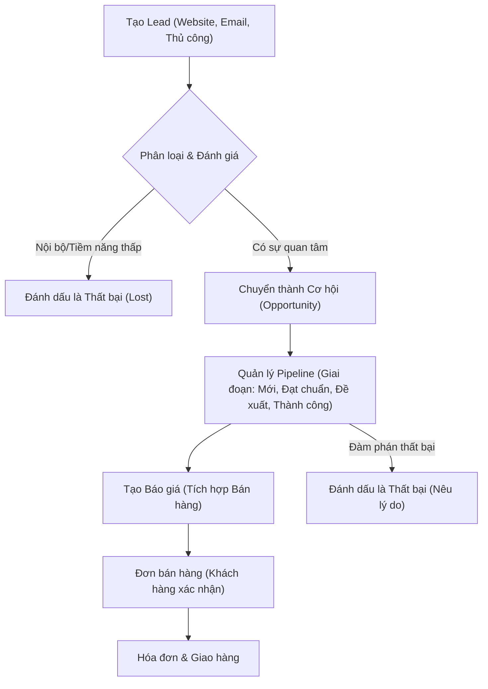

# Hướng dẫn Workflow Odoo CRM & Bán hàng

Tài liệu này cung cấp hướng dẫn toàn diện về quy trình kinh doanh tiêu chuẩn sử dụng Odoo CRM và sự tích hợp của nó với các module Bán hàng, Website và Marketing.

## Tổng quan về Workflow

Quy trình Odoo CRM tiêu chuẩn tuân theo cách tiếp cận dạng phễu từ việc tạo đầu mối (lead) đến việc chốt đơn hàng.

---

## 1. Tạo Lead (Nguồn tiềm năng)

Có ba cách chính để đưa lead vào Odoo:
- **Website CRM**: Tự động tạo lead từ các form "Liên hệ".
- **CRM LiveChat**: Chuyển đổi cuộc trò chuyện trực tuyến thành lead.
- **Tạo thủ công**: Nhân viên bán hàng nhập dữ liệu trực tiếp từ các cuộc gọi điện thoại hoặc mạng lưới quan hệ.

**Các trường quan trọng:**
- `Tên liên hệ`: Tên của người đó.
- `Tên công ty`: Tổ chức mà họ thuộc về.
- `Doanh thu mong đợi`: Giá trị ước tính của lead.

## 2. Phân loại & Đánh giá Lead (Qualification)

Sau khi một lead được tạo, nhân viên bán hàng phải "Đánh giá" nó:
- **Làm giàu dữ liệu (Enrich)**: Sử dụng Odoo IAP hoặc nghiên cứu thủ công để thêm chi tiết (mạng xã hội, quy mô công ty).
- **Hoạt động (Activities)**: Lên lịch cuộc gọi hoặc cuộc họp để hiểu yêu cầu.
- **Chuyển đổi**: Nếu hợp lệ, nhấn **[Chuyển thành Cơ hội]**.
  - *Lưu ý: Bạn có thể liên kết với khách hàng hiện tại hoặc tạo mới tại giai đoạn này.*

## 3. Quản lý Pipeline (Phễu bán hàng)

Sau khi chuyển thành **Cơ hội**, nó sẽ xuất hiện trong pipeline Kanban của bạn.

### Các giai đoạn (Stages):
1. **Mới (New)**: Vừa được chuyển từ Lead.
2. **Đạt chuẩn (Qualified)**: Các yêu cầu đã được xác nhận.
3. **Đề xuất (Proposition)**: Giải pháp hoặc báo giá đã được gửi đi.
4. **Thành công (Won)**: Khách hàng đã đồng ý bằng lời nói hoặc đơn hàng đã được ký.

### Hoạt động & Chatter:
- **Ghi chú (Log Notes)**: Cập nhật nội bộ cho đội ngũ.
- **Lên lịch hoạt động**: Đừng bao giờ để một cơ hội mà không có bước tiếp theo (Gọi điện, Họp, Email).
- **Email/SMS**: Giao tiếp trực tiếp với khách hàng từ phần chatter.

## 4. Tích hợp Bán hàng (Chuyển đổi thành Đơn hàng)

Khi khách hàng sẵn sàng nhận giá, nhấn **[Báo giá mới]** trên biểu mẫu Cơ hội.
- Odoo sẽ sao chép thông tin khách hàng và dữ liệu chiến dịch sang Đơn bán hàng.
- Sau khi khách hàng xác nhận (qua Cổng thông tin hoặc Email), nhấn **[Xác nhận]** để chuyển Báo giá thành **Đơn bán hàng**.

## 5. Theo dõi Sau bán hàng

- **Phân tích**: Sử dụng CRM > Báo cáo > Pipeline để xem tỷ lệ chuyển đổi.
- **Phân tích Thành công/Thất bại**: Hiểu lý do tại sao bạn thắng hoặc thua để cải thiện chiến lược.

---

## Kinh nghiệm thực tế (Best Practices)

> [!TIP]
> **Đừng bỏ qua các giai đoạn**: Việc di chuyển cơ hội qua các giai đoạn giúp dự báo doanh thu chính xác hơn.

> [!IMPORTANT]
> **Luôn lên lịch hoạt động tiếp theo**: Điều này đảm bảo không có khách hàng nào bị lãng quên.

> [!NOTE]
> Sử dụng **Màu sắc** và **Mức độ ưu tiên (Sao)** để làm nổi bật các giao dịch cấp bách trong chế độ xem Kanban.
